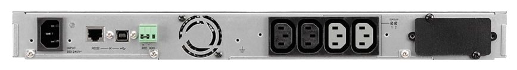
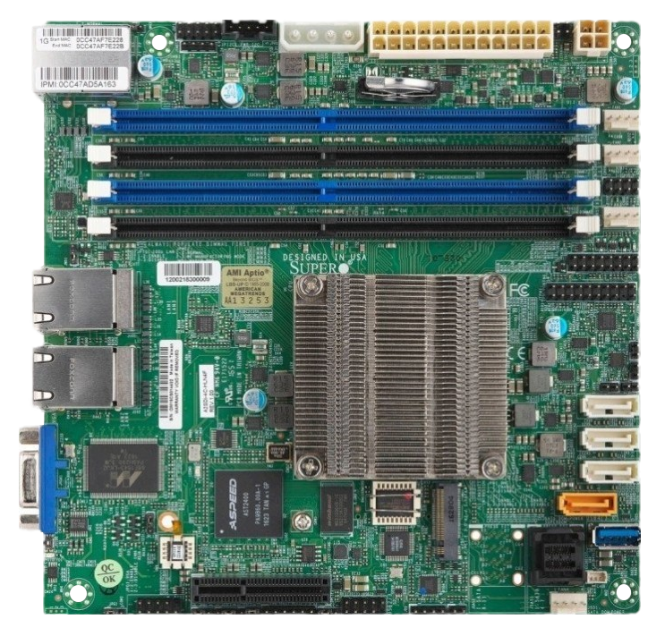

Infrastructure matérielle
=========================

Le serveur est auto-hébergé en France à Pantin.

```{seealso}
Les tickets concernant l'infrastructure matérielle sont regroupés sur le forum
[sous le tag *hardware*](https://forum.club1.fr/t/hardware).
```

Connexion à internet
--------------------

Il est relié à internet par fibre optique
avec des débits moyens de [200Mb/s en montant et 500Mb/s en descendant](https://www.nperf.com/fr/r/338260996-nDOmVdkc).
La connexion internet est fournie par *Bouygues Telecom*.


Onduleur
--------

Un onduleur, c'est avant tout **une multiprise**,
mais avec quelques fonctions supplémentaires, notamment :

- la protection contre les sur-tensions ou sous-tensions, par exemple en cas d'orages.
- le maintien de l'alimentation électrique en cas de coupure de courant
  (grâce à sa batterie interne).
- la communication avec le serveur pour lui dire de s'éteindre "proprement"
  lorsque le courant de revient pas et qu'il n'a bientôt plus de batterie.

Il est branché en amont de tout le matériel informatique et
son rôle est donc de leur fournir une **alimentation électrique de qualité**.

Notre modèle : `5P650IR` de la marque *EATON*
[Specifications sur le site du constructeur](https://www.eaton.com/fr/fr-fr/skuPage.5P650IR.specifications.html)

Nous l'avons sélectionné, entre autre,
car c'est la plus faible puissance (420W) parmi la gamme pro de chez *EATON*.
Le prix de ce matériel est assez élevé (un peu plus de 300€).
Auparavant, nous avions acheté en occasion un modèle plus bas de gamme pour 40€.
Celui-ci est tombé en panne après un an d'utilisation.


Il s'agit d'un modèle rackable d'une hauteur de 1U.
Un petit écran permet d'accéder à quelques statistiques et réglages.
Il indique par exemple la consommation électrique de l'ensemble de l'infrastructure en Watts.




De gauche à droite : l'arrivée du courant électrique,
les ports de communication avec le serveur,
puis les quatre sorties électrique bénéficiant des avantages de l'onduleur.

### Entretien

Les batteries internes sont garanties de 3 à 5 ans.
Leur changement se fait par la face avant de l'appareil.
Il n'est donc pas nécessaire de le dévisser ni de le débrancher lors de cette opération.


Serveur
-------


### Boitier

Modèle : `SilverStone RM21-304`
[Site du constructeur](https://www.silverstonetek.com/fr/product/info/server-nas/RM21-304/)


Boitier rackable d'un hauteur de 2U.

#### Refroidissement

L'un de nos intérêts pour se boîtier était la qualité de son refroidissement.
Il dispose de trois emplacements pour ventilateurs 80mm.
Les ventilateurs par défaut ont été remplacés par des modèles plus silencieux de la marque *Noctua*.


#### Ancien boitier


Précédement, nous utilisions un boitier `Chenbro ES34169`, qui était plus compact,
mais n'était pas rackable et moins bien refroidi.
Un [article du journal de bord](https://club1.fr/nouveau-boitier) retrace cette évolution.

### Carte mère

Modèle : `Supermicro A2SDi-4C-HLN4F`
[Site du constructeur](https://www.supermicro.com/en/products/motherboard/A2SDi-4C-HLN4F)

C'est une carte au format standard [Mini-ITX](https://en.wikipedia.org/wiki/Mini-ITX),
elle a donc un format carré de 17cm de bord.



**Connectiques principales :**

- stockage
  - Un port M.2
  - 4 ports SATA
- réseau
  - 4 ports RJ45 Ethernet 1Gb/s

### Processeur

Modèle : `Intel Atom C3000`

Processeur quadri-c&oelig;ur à faible consommation.
Il est directement soudé sur la [carte mère](#carte-mère).

### Mémoire vive

Modèle : `RAM Samsung ECC Registered 16Go M393A2G40DB0-CPB`

Le serveur dispose d'une unique barrette de 16 Go DDR4 ECC,
parmi les quatre emplacements fournis par la [carte mère](#carte-mère).
Cela laisse de la place pour augmenter cette capacité si nécessaire.


### Stockage

Il est composé de trois supports de stockage distincts :

#### système

Le système d'exploitation, ainsi que les bases de données {logiciel}`MariaDB` et PostgreSQL
sont sur un SSD NVMe d'une capacitée de 1To connecté au port M.2 de la carte mère.
C'est la configuration permettant d'avoir les débits les plus rapides permis par cette [carte mère](#carte-mère).

Modèle : `Samsung SSD 980 1To`

#### Utilisateurs

L'[espace personnel](/info/espace-personnel.md) des membres est stocké dans un second support :
Un autre SSD de 1To, mais cette fois ci, connecté sur un port SATA.
Les débit sont donc un peu plus faibles (500Mb/s), par rapport au [SSD système](#système).

Modèle : `Samsung EVO 860 1To`.

Un [article dans le journal de bord](https://club1.fr/ssd-home) raconte son arrivée dans le serveur.

#### Stockage secondaire

Disque dur de 2To 5600tr/min. Non pris en charge par les [sauvegardes](./general.md#sauvegardes).

### Alimentation

`FSP250-60EGA 90+`


