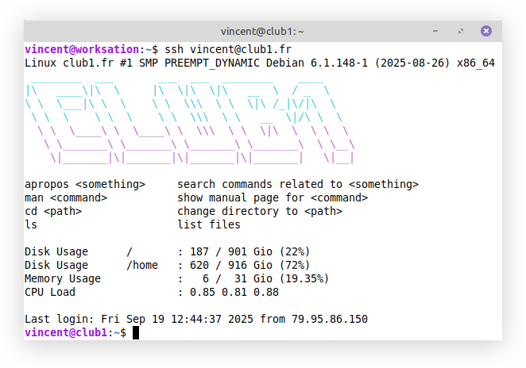

Connexion à distance SSH
========================

La connexion SSH est la connexion la plus intime que vous puissiez avoir avec le serveur.
C’est aussi celle qui peut le plus rappeler l'utilisation d'un ordinateur,
car à travers elle, on peut [lancer des programmes](#sélection-de-commandes) sur le serveur !



```{glossary}
SSH
   (_Secure SHell_) {term}`Protocole` permettant de se connecter à distance en {term}`CLI` à un serveur.
   Ses principaux avantages sont d'être entièrement chiffré
   et d'offrir un accès complet aux fonctionnalités du serveur.
   Il existe des extensions SSH pour des usages plus spécifiques comme {term}`SFTP` ou {term}`SCP`. ---
   [Wikipedia](https://fr.wikipedia.org/wiki/Secure_Shell)

SFTP
   (_SSH File Transfer Protocol_) {term}`Protocole` de transfert
   et gestion à distance de fichiers basé sur {term}`SSH`.
   Il est ainsi entièrement chiffré, et donc comparable à {term}`FTPS`,
   mais il offre plus de fonctionnalités (e.g. l'affichage des propriétaires d'un fichier). ---
   [Wikipedia](https://fr.wikipedia.org/wiki/SSH_File_Transfer_Protocol)

SCP
   (_Secure CoPy_) {term}`Protocole` de copie de fichiers entre deux ordinateurs basé sur {term}`SSH`.
   SCP s'utilise principalement à l'aide du {term}`client` en {term}`CLI` du même nom. ---
   [Wikipedia](https://fr.wikipedia.org/wiki/Secure_copy)
```

Se connecter
------------

```{warning}
La première connexion est **critique** car c'est lors de celle-ci que se fait
l'**échange des clés**. Pour éviter de subir une
[attaque de l'homme du milieu](https://fr.wikipedia.org/wiki/Attaque_de_l%27homme_du_milieu)
il nous faut être sûr d'avoir reçu la bonne clé lors de cet échange.

Si vous ne savez pas comment ajouter la clé du serveur à votre appareil,
le tuto [](/tutos/premiere-connexion-ssh.md) est fait pour vous !
```

Il existe deux manières de s'authentifier lors d'une connexion SSH.
La plus simple est d'utiliser un [mot de passe](#sauthentifier-par-mot-de-passe),
elle est en revanche moins sécurisée que l'utilisation d'une
[clé publique](#sauthentifier-avec-une-clé-publique).

### S'authentifier par mot de passe

On utilise la {term}`commande` suivante dans le {term}`terminal` pour se connecter
(remplacer `USER` par votre **identifiant** CLUB1) :

    ssh USER@club1.fr

Il faut ensuite entrer votre **mot de passe** CLUB1 (il est normal que le mot de passe ne s'affiche pas au moment de l'écriture).


### S'authentifier avec une clé publique

Au lieu d'utiliser un mot de passe,
si vous vous connectez régulièrement depuis le même appareil,
il est conseillé de se connecter à l'aide d'une clé publique.

Cela nécessite de suivre quelques étapes qui sont indiquées dans le tuto :
[Connexion SSH à l'aide d'une clé publique](/tutos/auth-ssh-avec-cle-publique.md)

Informations de connexion
-------------------------

| champ            | valeur            |
| ---------------- | ----------------- |
| hôte             | `club1.fr`        |
| port             | `22` (par défaut) |


Sélection de commandes
----------------------

Voici une sélection de {term}`commandes <commande>` pour vous permettre de découvrir le serveur :

```{tip}
Pour lancer une commande depuis le terminal, tappez son nom, puis appuyez sur {kbd}`Enter`.
```

```{commande} exit
Pour mettre fin à la connexion SSH avec le serveur.
```

```{commande} passwd
Permet de changer son mot de passe CLUB1
(cela aura donc un effet sur la connexion à tous les [services](/services-membres.md)).
--- Manuel : {manpage}`passwd.1`
```

```{commande} htop
Permet de voir ce qui se passe sur le serveur en ce moment et à quel point les ressources sont utilisées.  
Pressez la touche {kbd}`Q` pour quitter.
--- Manuel : {manpage}`htop.1`
```

```{commande} ncdu
Outil visuel et rapide pour trouver les fichiers ou dossiers qui prennent le plus de place.
Idéal pour faire du rangement !
Naviguez simplement avec les flèches directionnelles.
Pressez la touche {kbd}`Q` pour quitter.
--- Manuel : {manpage}`ncdu.1`
```

```{commande} w
Affiche les membres connectés en SSH et indique le logiciel qu'ils sont en train d'utiliser.
Cette commande est un peu intrusive !
--- Manuel : {manpage}`w.1`
```

```{commande} members
Affiche les membres d'un {term}`groupe` :

    members GROUP

En remplaçant GROUP par le groupe voulu. Exemple : `members sudo` ou `members compta`.
--- Manuel : {manpage}`members.1`
```

````{commande} mailx
La façon la plus basique d'envoyer un email !
Cette commande nécessite de rajouter au bout, après un espace, l'email de votre destinataire.

```{tip}
Si vous envoyez à un membre CLUB1, pas besoin de rajouter `@club1.fr` !
```

Renseignez le sujet lorsqu'on vous le demande, puis confirmez en pressant {kbd}`Enter`.
Composez ensuite votre message.
Lorsque vous avez terminé, créez une nouvelle ligne puis tapez {kbd}`CTRL` + {kbd}`D`.
Enfin vous pouvez si vous le souhaitez ajouter des destinataires en copie.
--- Manuel : {manpage}`mailx.1 <bsd-mailx/mailx.1>`
````

```{commande} mutt
Permet de consulter et d'envoyer ses emails avec {logiciel}`Mutt` :
Un {term}`client` email en {term}`CLI`.
Les touches de contrôle sont indiqués en haut.
Pressez la touche {kbd}`Q` pour quitter.
--- Manuel : {manpage}`mutt.1`
```

````{commande} goaccess
Un outil qui permet de visualiser la fréquentation de ses sites {term}`Web` en analysant les {term}`logs <log>`.
Cette commande nécessite de rajouter au bout,
après un espace, le fichier de log que vous souhaitez analyser.

```{note}
Les logs de {logiciel}`Apache`, qui sert les sites Web,
sont stockés dans le dossier `log` de votre [espace perso](../info/espace-personnel.md#-log).
```

Naviguez entre les sections avec {kbd}`Tab`, utilisez {kbd}`Enter` pour en étendre une.  
Pressez la touche {kbd}`Q` pour quitter.
--- Manuel : {manpage}`goaccess.1`
````

```{commande} man
Affiche la page de manuel correspondant à une commande.
Celle-ci devra être indiquée après un espace.
La plupart des pages de manuel sont en anglais.  
Pressez la touche {kbd}`Q` pour quitter.
--- Manuel : {manpage}`man.1`
```

Logiciels
---------

```{logiciel} OpenSSH
Logiciel fournissant à la fois un {term}`serveur` et un {term}`client` {term}`SSH`.
--- [Wikipedia](https://fr.wikipedia.org/wiki/OpenSSH),
[Sources](https://anongit.mindrot.org/openssh.git)
```
