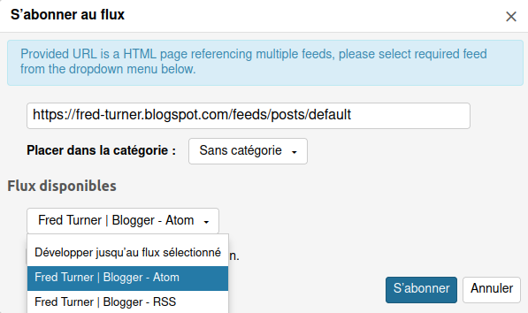
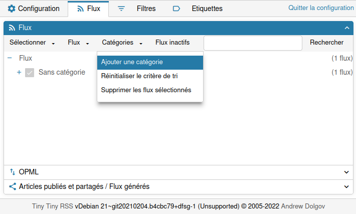

Utiliser Tiny tiny RSS
======================

Ce tutoriel explique comment utiliser [l'agrégateur de flux Web de CLUB1](/services/rss.md).

Cet {term}`agrégateur de flux` permet de "s'abonner" à de multiples sites web,
pour recevoir des notifications lorsqu'un nouvel article est posté
et pour tous les consulter dans un fil d'actualités commun.

Accéder à son compte de flux RSS
--------------------------------

Pour accéder à votre compte, vous pouvez vous connecter avec vos identifiants CLUB1 à cette adresse : <https://rss.club1.fr/>

S'abonner à un flux RSS
-----------------------

Pour recevoir les dernières nouveautés d'un site web, il faut "s'abonner à son flux d'actualités".
Pour cela, le plus simple est de l'ajouter depuis l'interface de _Tiny Tiny RSS_.

```{note}
Vous aurez besoin de l'adresse (aussi appelée URL) du site web auquel vous voulez vous abonner.
Pour l'obtenir, vous pouvez visiter le site en question avec un navigateur web
depuis lequel il est possible de copier l'URL depuis la barre de recherche.
```

Une fois connectés, cliquez en haut à droite sur le logo de menu à 3 barres, puis sur `s'abonner au flux...`


Entrez l'url du site dont vous voulez obtenir le {term}`flux de nouvelles`, par exemple ici le blog de Fred Turner.
Si vous avez créé des catégories, vous pouvez en sélectionner une pour trier votre flux (c'est possible de le faire plus tard)
puis cliquez sur `S'abonner`.

```{warning}
Il est possible qu'un site ne propose pas de flux de nouvelles,
dans ce cas il ne sera malheureusement pas possible de s'y abonner.
```


Parfois, plusieurs flux sont disponibles : `Atom` ou `RSS`.
Il est conseillé de sélectionner `Atom` car c'est un format de données plus récent.



Et voilà ! Vous vous êtes abonné à votre premier flux d'actualités.
À partir de maintenant il vous est possible de lire les derniers articles de ce site depuis l'agrégateur.

Vous pouvez bien-sûr vous abonner à plusieurs flux, c'est même recommandé !

> C'est bien joli tout ça, mais quand on suit beaucoup de sites,
> ça met un peu le bazar de tout rassembler dans un seul fil !

Pour résoudre ce problème, il est possible d'utiliser les catégories.

Utiliser les catégories
-----------------------

Les catégories permettent de rassembler les flux auxquels vous vous êtes abonné dans des groupes, un peu comme des dossier.
Elles sont utiles par exemple pour recréer un sous-fil d'actualités thématique,
surtout lorsqu'on est abonné à beaucoup de sites.

Pour créer une catégorie, il faut retourner dans le menu en haut à droite de l'écran principal et cliquer sur `Configuration...`.
Aller dans l'onglet Flux en haut de l'écran.



Vous pouvez depuis la nouvelle fenêtre ouverte créer une nouvelle catégorie pour ranger vos articles.

En cliquant sur le plus à gauche de chaque catégorie, on visualise les flux qu'il contient.
Pour modifier la catégorie d'un flux, il suffit de *cliquer glisser* le flux vers une nouvelle catégorie.

Choisir un mode d'affichage
---------------------------

Par défaut, l'affichage se fait en mode combiné.


Pour utiliser un mode d'affichage en liste avec un panneau de lecture séparé,
vous pouvez désactiver le "mode combiné" dans la configuration.


```{tip}
Il est possible de passer en mode _trois colones_ avec le panneau de lecture à droite,
ce qui est pratique lorsqu'on a un écran large.

Ceci se fait depuis le menu, en cliquant sur `Basculer le mode écran large`.
```


```{raw} latex
\clearpage
```
