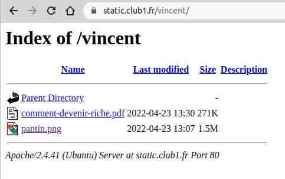
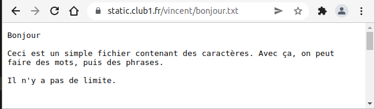
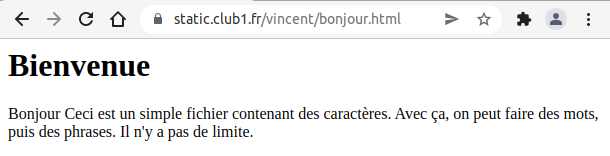

Mes premiers pas sur le Web !
=============================

Vous connaissez le Web ? Ça vous dirait d'y participer ?
Pas mettre un post sur facebook, ça c'est juste remplir un formulaire.
Mais plutôt de rajouter une pierre à ce gigantesque édifice.


Fini les conneries, ici on va carrément rajouter des fichiers au Web.

Dans ce tuto, vous allez découvrir comment utiliser votre espace CLUB1,
non pas pour stocker des fichiers dans un but personnel,
mais pour les rendre accessible à tout le monde,
c.-à-d. les publier sur le Web.

Se connecter à son espace perso
-------------------------------

Tout d'abord, il faut vous connecter à votre espace sur le serveur d'une manière ou d'une autre.
Vous pouvez choisir la méthode de connexion avec laquelle vous vous sentez la plus à l'aise.

Petit rappel des différentes façons de se connecter :

- [drive](/services/drive.md) en accédant à `https://drive.club1.fr`
méthode la plus facile (ne nécessite aucun logiciel)
- [ftp](/services/ftp.md) pas beaucoup plus compliqué (nécessite un logiciel)
- [ssh](/services/ssh.md) plus avancée
- [WebDAV](/services/webdav.md) pratique si vous avez déjà configuré un accès

Partager un fichier sur le Web
------------------------------

### Découverte du dossier `static`

La façon la plus rapide et simple de partager un fichier depuis son espace perso
est de le placer dans le dossier `static`.

```{note}
Si ce dossier n'existe pas, il faut le créer.
```

Choisissez une image depuis votre ordinateur ou smartphone et
téléversez la sur le serveur dans votre dossier `static`.

```{warning}
Par précaution, il vaut mieux vérifier que le nom de fichier
ne comporte pas d'espaces ou de caractères spéciaux.
```

Si tout s'est bien passé,
il est maintenant possible d’accéder à votre image depuis le Web.
Pour voir le résultat, il faut entrer l'adresse suivante dans un navigateur Web
(e.g. Firefox, Chrome, etc.) :

    https://static.club1.fr/USER/FILE

Par exemple, si votre nom d'utilisataire est `garance` et que votre fichier s'intitule `fleur.jpg`, vous devriez avoir :

    https://static.club1.fr/garance/fleur.jpg

Normalement, le navigateur va afficher votre image si il en est capable, autrement,
il vous proposerait de la télécharger.

Par exemple, la plupart des navigateurs arrivent à afficher des fichiers PDF, lire des MP3,
tandis que des fichiers d'archives (Zip, Tar...) seront téléchargés
car le navigateur Web ne sait pas lire ce genre de fichier.

Vous pouvez essayer de téléverser d'autres types de fichiers et d'accéder aux URL correspondantes.

### Avoir un fichier en ligne

Ça y est ! Vous avez publié votre premier fichier sur le Web ! 🎉
L'adresse que vous avez tapé dans le navigateur s'appelle une URL.
Cette URL ne changera pas tant que vous ne modifiez pas le nom du fichier.
Pour partager ce fichier avec n'importe qui,
il vous suffit de transmettre cette URL.
Toutes les personnes explorant l'URL pourront accéder au fichier en l'affichant ou en le téléchargeant,
mais ne pourront pas le supprimer ou le modifier.
Pour arrêter de publier un fichier sur le Web,
il vous suffit de le supprimer depuis votre espace perso,
ou de le déplacer hors du dossier `static`.

Ce comportement du dossier `static` fait partie des [services d'hébergement CLUB1](/services/web.md).
Il permet d'avoir une porte ouverte sur le Web très facile d'accès et rapide à utiliser.
Cela peut être utile si l'on veut partager rapidement des fichiers,
publier un CV au format PDF ou insérer des images dans d'autres endroit du Web.
Il est ensuite très facile de partager l'URL via emails ou réseaux sociaux.

### L'index

Et si je voulais partager 15 fichiers, j'aurais 15 URLs à partager ? C'est casse-pied !
N'y aurait-il pas un moyen de partager un dossier complet ?

Faisons une expérience (si vous ne l'avez pas déjà faite par vous même) :
Dans votre navigateur Web, retirez la partie correspondant au nom du fichier.

    https://static.club1.fr/USER/

```{warning}
N'oubliez pas le dernier slash (`/`) de l'URL !
```

Vous devriez avoir accès à une page listant les fichiers de votre dossier `static`.



On appelle cette page un __index__.
Cette page est générée par le serveur Web qui s'appelle *Apache* (c'est marqué en bas).
Elle se mettra à jour toute seule si vous rajoutez ou supprimez des fichiers.

```{note}
Pour un usage plus avancé, il est possible de désactiver les pages d'index.
Voir les [services liés au dossier static](../services/web.md#index-des-fichiers)
```


### Écrire du texte sur le Web

Parmi les types de fichiers intéressant à publier sur le Web,
il en est un qui présente quelques intérêts particuliers.
Il s'agît du fichier texte simple, qui a une extension en `.txt`.

Ce type de fichier est très facile à éditer et a le mérite d'être lisible par un navigateur Web.

Essayons donc de créer un fichier de ce type,
éditer son contenu en écrivant ce qui vous plaît,
puis le téléverser dans le dossier `static`.

````{note}
```{only} builder_html
Si vous ne savez pas comment créer un fichier TXT, vous pouvez
<a download class="fa fa-download" href="../_static/tutos/mes-premiers-pas-sur-le-web/bonjour.txt">
  télécharger celui-ci
</a>
puis l'éditer.
```
```{only} not builder_html
Si vous ne savez pas comment créer un fichier TXT, vous pouvez
[télécharger celui-ci](https://club1.fr/docs/fr/_static/tutos/mes-premiers-pas-sur-le-web/bonjour.txt),
puis l'éditer.
```
````

Lorsque vous accédez à l'URL correspondant au nom de votre fichier texte,
vous devriez pouvoir lire ce que vous y avez écrit.



C'est une façon simple et efficace de publier du texte en ligne.
Juste avec cette méthode, il est déjà possible de faire un embryon de site web.
Cependant, on ne peut pas intégrer d'images,
changer le style du texte ou encore, __faire des liens__.

Pour cela, il nous faut apprendre à manipuler un language spécifique au web.

Le language HTML
----------------

### Premiers pas

Reprenons notre fichier TXT.
Au dessus de ce que vous aviez précédemment écrit, rajoutez la ligne suivante :

```html
<h1>Bienvenue</h1>
```

Au lieu d'enregistrer le fichier sous un `.txt`,
enregistrez le avec un `.html`

> Le fichier `bonjour.txt` deviendrait `bonjour.html`

```{note}
Vous pouvez faire ceci en renommant votre fichier ou
en sélectionnant "enregistrer sous" depuis votre éditeur de texte.
```

Maintenant, téléversez à nouveau le fichier dans votre dossier `static`,
accédez à l'URL correspondante depuis votre navigateur
et découvrez le résultat !



Félicitation !
Vous venez de mettre en ligne votre première page Web contenant du HTML. 🎉

Maintenant, regardons plus attentivement la ligne que nous venons d'ajouter.
Le texte "Bienvenue" s'est vu affiché,
__mais pas les éléments `<h1>` et `</h1>`__.
On appelle ces deux éléments des __balises HTML__.
Elles sont utilisés pour rajouter des informations à notre texte.

En l'occurrence, la balise `<h1>` signifie :
*les caractères qui suivent font partie d'un titre de niveau&nbsp;1*.
Il s'agît d'une balise __ouvrante__.

Tandis que la balise `</h1>` signifie :
*les caractères qui suivent ne font __plus__ partie d'un titre de niveau&nbsp;1*.
Cette dernière est donc une balise dite __fermante__.

Ces balises forment un couple, on les appelles des __balises doubles__.
à elles deux, elles attribuent un statut à ce qu'elles entourent.

Le navigateur Web, de son côté,
a interprété ces balises et à *compris* que "Bienvenue" est un "titre de niveau&nbsp;1".
Il applique ensuite un style par défaut associé à ce statut.

C'est globalement comme cela que fonctionne la language HTML,
tout du moins les balises doubles.
Évidemment, il existe [des balises pour de nombreux usages](https://developer.mozilla.org/fr/docs/Web/HTML/Reference/Elements).
Par exemple, vous avez sûrement remarqué que les saut de lignes ne sont pas interprétés en HTML.
C'est normal ! Pour faire des paragraphes, il faut mettre son texte à l'intérieur d'une
[balise `<p>`](https://developer.mozilla.org/fr/docs/Web/HTML/Reference/Elements/p).


### Éditer en local

Comme on commence à modifier souvent notre fichier,
au lieu de devoir à chaque fois mettre à jour nos modifications en le téléversant sur le serveur,
on va le modifier et l'afficher __en local__.

💫 Et oui ! Pas besoin de serveur pour juste lire un fichier HTML.
Il suffit de l'ouvrir avec votre navigateur directement
(par exemple en double cliquant dessus ou en le glissant dans votre navigateur).

C'est une façon de travailler qui consiste à ne pas mettre à jour sa page web à chaque essais,
que l'on fait en local,
mais plutôt à chaque fois que l'on est satisfait de ses modifications.


Pour aller plus loin
--------------------

Pour continuer à en apprendre plus sur le HTML, vous pouvez explorer :

- Les ressources HTML et CSS sur le site
[Radical Web Design](https://radicalweb.design/ressources/html/),
- [Open Class Room / Créez votre site web avec HTML5 et CSS3](https://openclassrooms.com/fr/courses/1603881-creez-votre-site-web-avec-html5-et-css3)
(nécessite un compte gratuit 🫤).

Vous pouvez aussi consulter [l'annuaire du site de CLUB1](https://club1.fr/annuaire) pour plus d'outils.


```{raw} latex
\clearpage
```
