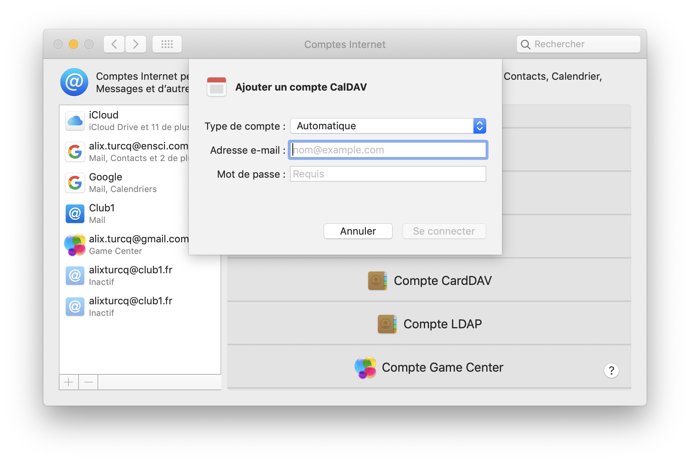

Synchronisation de calendrier CalDAV sur un Mac
===============================================

Cette méthode permet de synchroniser ses calendriers entre le serveur et un appareil Mac.

L'opération se fait directement depuis l'application Calendrier Apple.

Dans la barre de menu il faut se rendre dans **Calendrier**
puis **Comptes...** pour afficher la fenêtre de configuration de **Comptes Internet**.

Pour ajouter un compte CLUB1 il faut cliquer sur **Ajouter un autre compte**
et choisir CalDAV (WebDAV pour les calendriers)

Dans la fenêtre dépliée, entrer son adresse et son mot-de-passe membre CLUB1.

Une fois validé, un calendrier "Default" apparaîtra sous CLUB1 dans le panneau de gauche de l'application Calendrier.

Bravo.
