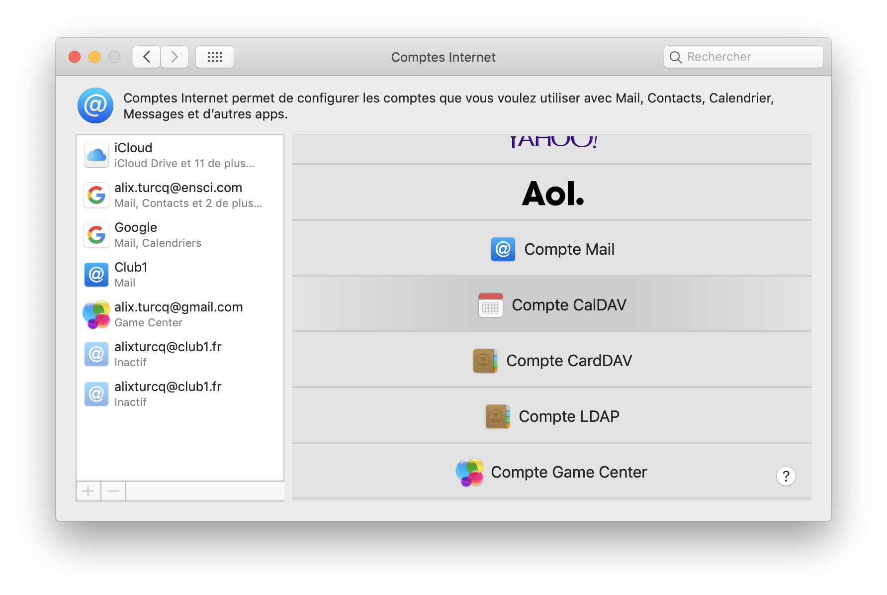
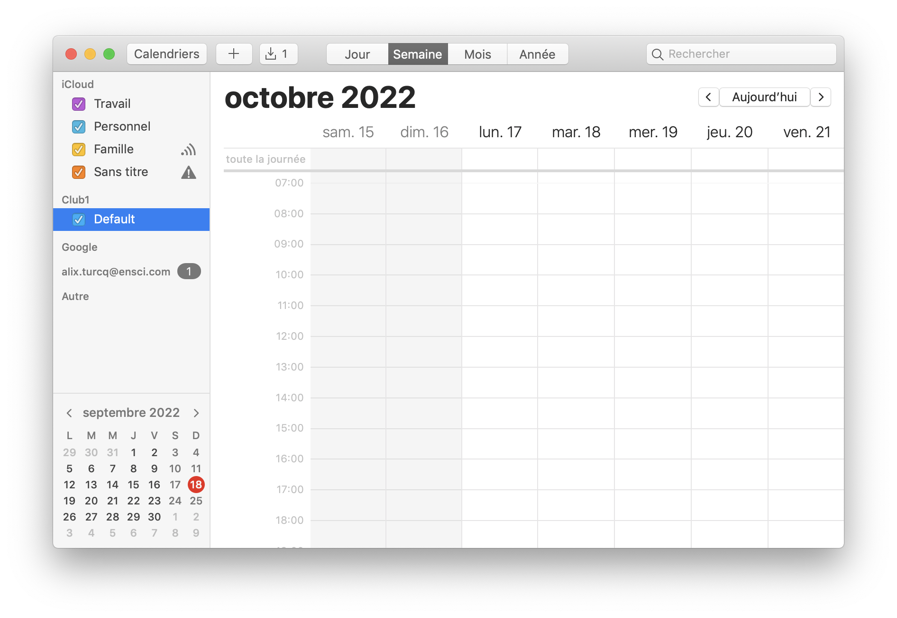

# Synchronisation de calendrier CalDav sur un Mac

Cette méthode permet de synchroniser ses calendriers entre le serveur et un appareil Mac.

L'opération se fait directement sur l'application Calendrier Apple. 

Dans la barre de menu il faut se rendre dans **Calendrier**
puis **Comptes...** pour afficher la fenêtre de configuration de **Comptes Internet**.

Pour ajouter un compte club1 il faut cliquer sur **Ajouter un autre compte**
et choisir CalDAV (WebDAV pour les calendriers)

Dans la fenêtre déplié entrer son adresse et son mot-de-passe membre Club1.

Une fois validé, un calendrier "Default" apparaitra sous Club1 dans la sidebar de l'application Calendrier. 

Bravo.
