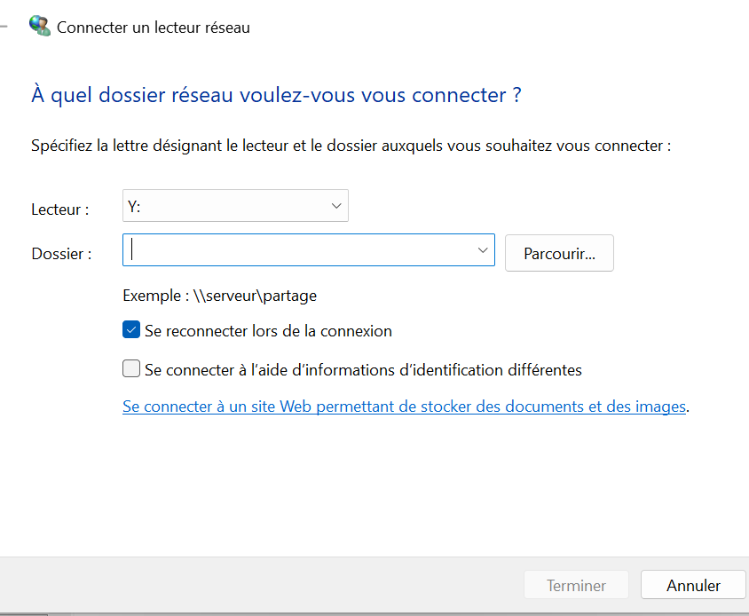
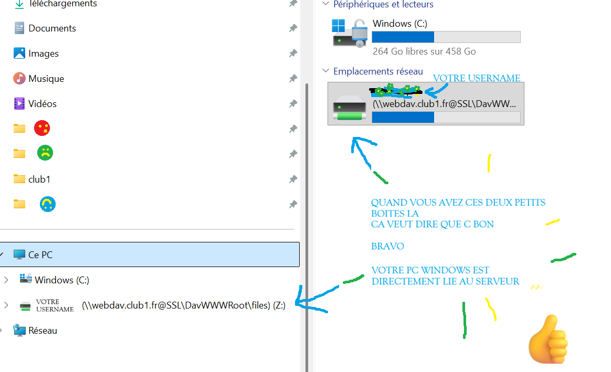

Accès à l'espace personnel depuis le gestionnaire de fichiers de Windows 11
===========================================================================

```warning
Ce tuto marche peut-être pour d'autres versions de windows (Windows 10 par exemple),
mais cela n'a pas encore pu être testé.
```

```info
Ce tuto est en cours de finition.
Il est adapté du post de forum
[Synchroniser les dossiers avec le serveur sous windows 11](https://forum.club1.fr/d/311-synchroniser-les-dossiers-avec-le-serveur-sous-windows-11).
```

**étape 1** : aller dans le gestionnaire de fichiers Windows

**étape 2** : faire 1 clic droit sur {guilabel}`Ce PC`

**étape 3** : choisir dans la liste d'action {guilabel}`connecter un lecteur réseau`

**étape 4** :

Une petite fenêtre apparaît qui demande " à quel dossier réseau voulez-vous vous connecter ?"
Pour le lecteur vous pouvez laisser celui par défaut (`Z:`)
et pour le dossier j'ai copié collé cette URL :

    https://IDENTIFIANT@webdav.club1.fr/files/IDENTIFIANT

En remplaçant `IDENTIFIANT` par votre identifiant de membre sur le serveur.



**étape 5** :

Après avoir copié cette url dans la ligne "Dossier", et écrit aux endroits nécessaires votre nom d'utilisateur et avoir cliqué sur {guilabel}`Terminer`, une nouvelle fenêtre propose ensuite de rentrer votre identifiant et votre mot de passe.
Faites le donc 😄.

**étape 6** :

Après avoir rentré votre mot de passe, normalement ça devrait marcher.

Quand ça marche vous aurez ceci :



**VOILA**

Votre espace personnel club1 est accessible dans les fichiers tant qu'il y a internet,
sous l'onglet ce PC dans mes réseaux.
Et les fichiers sont directement ouvrables avec un éditeur de code ou autres logiciels
